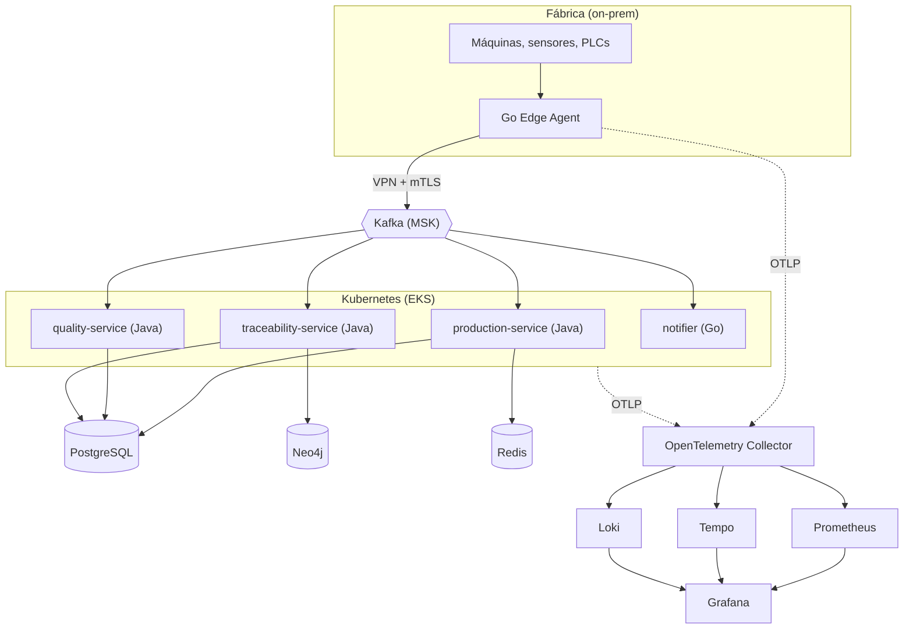

# Diagrama geral

## Leitura
1. O [[Go Edge Agent]] coleta, normaliza e reenvia eventos, com buffer local para tolerar queda de rede.
2. O [[Kafka]] é o backbone. Os serviços também **publicam** eventos de volta via [[Outbox Pattern]] (a seta só mostra o consumo para não poluir).
3. O [[traceability-service]] projeta os eventos no [[Neo4j]] (grafo de genealogia).
4. Toda telemetria passa pelo [[OpenTelemetry]] Collector. Ver [[Observabilidade]].

## Diagramas relacionados
- Estrutura interna de um serviço: [[Arquitetura Hexagonal]]
- Grafo de lotes: [[Modelo de Grafo]]
- Infra na AWS: [[AWS Mapeamento]]
