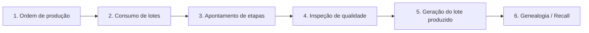

# Fluxo principal: da ordem ao lote rastreável

| # | Etapa | O que acontece | Evento | Onde vive |
|---|---|---|---|---|
| 1 | Ordem de produção | Recebimento da OP (ERP ou sistema) | `production.started` | [[production-service]] |
| 2 | Consumo de lotes | Baixa de matérias-primas e componentes | `material.consumed` | [[production-service]], [[traceability-service]] |
| 3 | Apontamento de etapas | Início e fim das etapas | `machine.telemetry` e eventos de etapa | [[Go Edge Agent]], [[production-service]] |
| 4 | Inspeção de qualidade | Registros de inspeção e resultados | `quality.inspection` | [[quality-service]] |
| 5 | Geração do lote produzido | Conclusão e identificação do lote | `production.completed` | [[production-service]] |
| 6 | Genealogia / Recall | Rastreabilidade completa | (consulta) | [[traceability-service]], [[Neo4j]] |

Detalhes dos eventos em [[Catalogo de Eventos]]. Consultas em [[Recall e Rastreio]].

## Consulta-chave
Rastrear lote: origem, processo, operadores, máquina, qualidade e destino.
