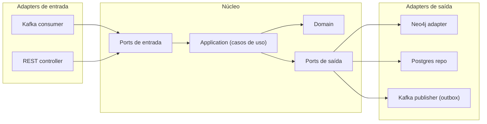

# Arquitetura Hexagonal (ports and adapters)

O **núcleo** (domínio + casos de uso) não conhece tecnologia. Ele expõe **ports** (interfaces). Os **adapters** implementam esses ports com Kafka, REST, Neo4j, Postgres etc. Dependências apontam **sempre para dentro**.



## Regras práticas
1. `domain` não importa Spring, Kafka, JPA nem Neo4j.
2. Casos de uso dependem de **interfaces** (ports), nunca de implementações.
3. Adapters convertem entre o modelo externo (DTO, evento, entidade de banco) e o modelo de domínio.
4. Testes do núcleo rodam **sem** Spring e sem infraestrutura.
5. Automatize a regra com testes de arquitetura (ex.: ArchUnit em Java).

## Exemplo de ports (Java)
```java
// port de entrada
public interface RegistrarConsumoUseCase {
    void executar(RegistrarConsumoCommand cmd);
}

// port de saída
public interface LoteGrafoPort {
    void registrarConsumo(CodigoLote lote, CodigoOrdem ordem);
}
```

## Onde se aplica
[[production-service]] · [[quality-service]] · [[traceability-service]] · [[Go Edge Agent]] (versão enxuta em Go)

## Relacionado
[[Outbox Pattern]] (o publisher é um adapter de saída) · [[Idempotencia e DLQ]]
