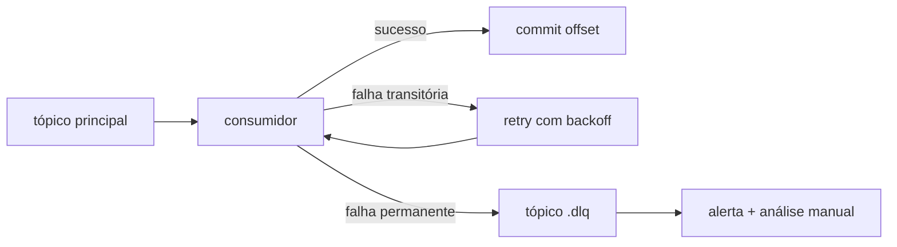

# Idempotência, retry e DLQ

## Idempotência
Todo evento carrega `event_id` ([[Eventos e Schema Registry]]). O consumidor registra os ids processados (`processed_event`, ver [[Modelo Relacional]]) e ignora repetições. Para o [[Neo4j]], prefira `MERGE` em vez de `CREATE`.

## Retry
Falhas transitórias (banco fora, timeout): tentar de novo com backoff.

## DLQ
Falhas permanentes (payload inválido, regra violada): enviar para tópico `*.dlq` com o motivo, e alertar no [[Grafana]].

## Vale para
[[traceability-service]] · [[production-service]] · [[quality-service]] · [[notifier-service]]

## Relacionado
[[Outbox Pattern]] · [[Kafka]]
