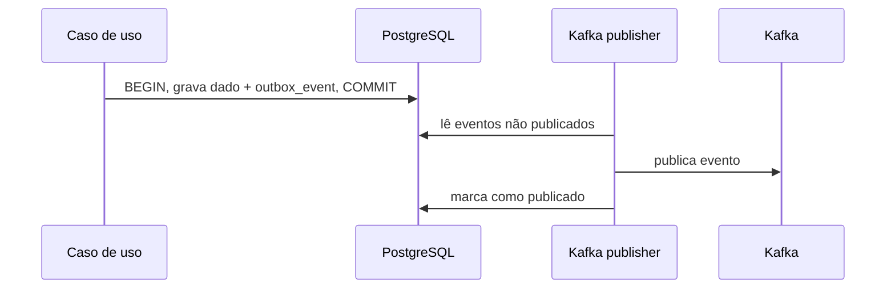

# Outbox pattern

## Problema
Gravar no [[PostgreSQL]] e publicar no [[Kafka]] são duas operações. Se uma falhar, perde-se ou duplica-se evento.

## Solução
Na **mesma transação** do dado de negócio, grava-se o evento em `outbox_event`. Um processo separado lê a tabela e publica no Kafka.

## Variações
- **Polling**: publisher lê a tabela periodicamente. Mais simples para começar.
- **CDC (Debezium)**: lê o log do banco. Menor latência, mais peças.

Comece com polling e decida depois ([[Perguntas em Aberto]]).

## Garantia resultante
*At least once*. Por isso os consumidores precisam ser idempotentes: [[Idempotencia e DLQ]].

## Estrutura da tabela
Ver [[Modelo Relacional]].

## Decisão
[[ADR-003 Outbox pattern]]
