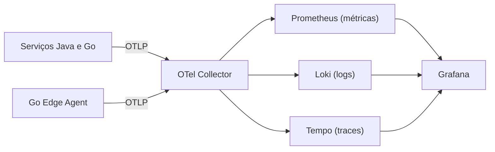

# Observabilidade

Três sinais: **métricas**, **logs** e **traces**.

## Notas
- [[OpenTelemetry]]: instrumentação e Collector
- [[Prometheus]]: métricas e alertas
- [[Loki e Tempo]]: logs e traces
- [[Grafana]]: dashboards

## Princípio
Os serviços falam só OTLP. Trocar o backend (ex.: Managed Prometheus/Grafana na AWS) não exige mexer no código. Ver [[ADR-006 OpenTelemetry como padrao de telemetria]].

## O que observar
- Latência e erros por serviço
- **Lag** dos consumidores Kafka
- Tamanho do buffer e falhas de envio do [[Go Edge Agent]]
- Mensagens em DLQ ([[Idempotencia e DLQ]])
- Tempo das consultas de recall ([[Recall e Rastreio]])
