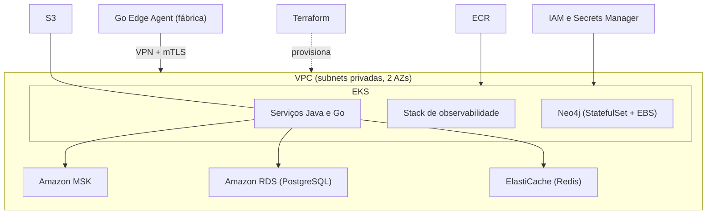

# Mapeamento para a AWS

| Componente | AWS | Nota |
|---|---|---|
| Kubernetes | EKS | [[Kubernetes e Docker]] |
| [[Kafka]] | MSK | Provisionado ou Serverless; auth IAM ou mTLS |
| [[PostgreSQL]] | RDS | Multi-AZ em produção |
| [[Redis]] | ElastiCache | |
| [[Neo4j]] | EKS (StatefulSet), AuraDB ou Neptune | Ver abaixo |
| Imagens Docker | ECR | |
| Arquivos e evidências | S3 | Laudos, imagens de inspeção |
| Identidade e segredos | IAM, Secrets Manager | [[Seguranca]] |
| Métricas/dashboards | Self-hosted no EKS ou Managed Prometheus/Grafana | [[Observabilidade]] |

## As quatro decisões que a AWS traz
1. **Neo4j**: a AWS não tem Neo4j gerenciado próprio. Opções: StatefulSet no EKS, AuraDB (Marketplace) ou Neptune (suporta openCypher, mas com diferenças; testar as queries de [[Recall e Rastreio]]).
2. **Kafka**: MSK com IAM ou mTLS. É um dos itens mais caros; para estudo, menor tamanho ou Serverless.
3. **Edge → nuvem**: [[Conexao Edge-Nuvem]].
4. **Observabilidade**: self-hosted ou gerenciada. O Collector mantém a portabilidade ([[ADR-006 OpenTelemetry como padrao de telemetria]]).

## Custos (ambiente de estudo)
NAT Gateway, EKS e MSK cobram por hora mesmo ociosos. Mantenha `dev` mínimo e destrua quando não usar ([[Terraform]]).

## Relacionado
[[Perguntas em Aberto]]
