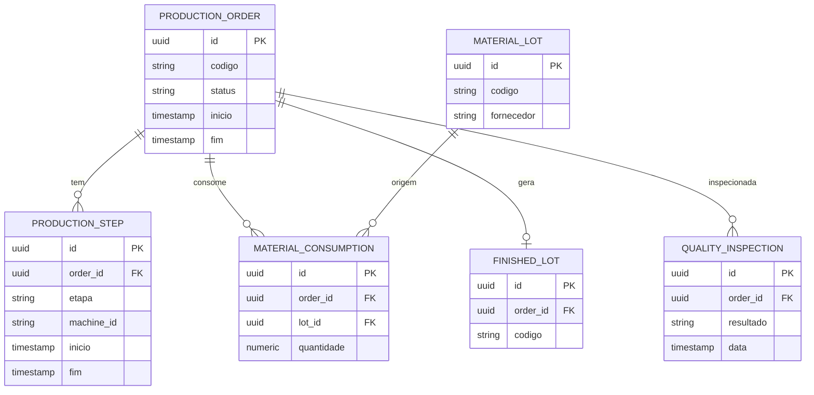

# Modelo relacional (PostgreSQL)

Rascunho inicial. A genealogia completa vive no [[Neo4j]] ([[Modelo de Grafo]]); aqui fica o estado transacional.

## Tabelas técnicas
| Tabela | Uso | Nota |
|---|---|---|
| `outbox_event` | eventos a publicar (`id`, `aggregate_id`, `type`, `payload`, `created_at`, `published_at`) | [[Outbox Pattern]] |
| `processed_event` | ids de eventos já processados (`event_id` PK, `processed_at`) | [[Idempotencia e DLQ]] |

## Retenção
Particionar por data as tabelas de alto volume: [[Retencao de Dados]].

## Usado por
[[production-service]] · [[quality-service]] · [[traceability-service]] · [[PostgreSQL]]
