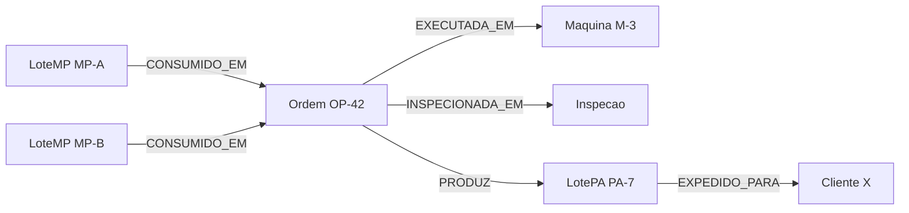

# Modelo de grafo

Genealogia de lotes no [[Neo4j]], alimentada pelo [[traceability-service]].



## Nós
| Label | Propriedades principais |
|---|---|
| `LoteMP` | `codigo`, `fornecedor`, `recebidoEm` |
| `LotePA` | `codigo`, `produto`, `producaoEm` |
| `Ordem` | `codigo`, `inicio`, `fim` |
| `Maquina` | `codigo`, `linha` |
| `Inspecao` | `id`, `resultado`, `data` |
| `Cliente` | `codigo`, `nome` |

## Relações
```cypher
(:LoteMP)-[:CONSUMIDO_EM]->(:Ordem)-[:PRODUZ]->(:LotePA)-[:EXPEDIDO_PARA]->(:Cliente)
(:Ordem)-[:EXECUTADA_EM]->(:Maquina)
(:Ordem)-[:INSPECIONADA_EM]->(:Inspecao)
```

## Restrições e índices
```cypher
CREATE CONSTRAINT lote_mp_codigo IF NOT EXISTS FOR (l:LoteMP) REQUIRE l.codigo IS UNIQUE;
CREATE CONSTRAINT lote_pa_codigo IF NOT EXISTS FOR (l:LotePA) REQUIRE l.codigo IS UNIQUE;
CREATE CONSTRAINT ordem_codigo   IF NOT EXISTS FOR (o:Ordem)  REQUIRE o.codigo IS UNIQUE;
```

## Escrita idempotente
Use `MERGE`, nunca `CREATE`, ao projetar eventos ([[Idempotencia e DLQ]]).
```cypher
MERGE (l:LoteMP {codigo: $lote})
MERGE (o:Ordem  {codigo: $ordem})
MERGE (l)-[:CONSUMIDO_EM]->(o)
```

## Multiníveis
Se um produto intermediário virar componente de outra ordem, adicione um label base `:Lote` nos dois tipos e permita `(:LotePA)-[:CONSUMIDO_EM]->(:Ordem)`. As consultas de [[Recall e Rastreio]] já usam profundidade variável.

## Decisão
[[ADR-002 Neo4j para genealogia]]
