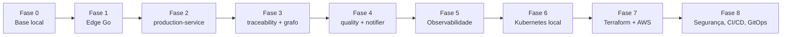

# Roadmap

Ordem pensada para ter algo funcionando cedo e evoluir. Progresso detalhado em [[Checklist]].

| Fase | Objetivo | Notas |
|---|---|---|
| 0 | `docker compose` com Kafka, Postgres, Neo4j, Redis e stack de observabilidade | [[Kubernetes e Docker]], [[Observabilidade]] |
| 1 | [[Go Edge Agent]] com simulador de máquinas, buffer local e envio ao Kafka | [[Catalogo de Eventos]] |
| 2 | [[production-service]] hexagonal com [[Outbox Pattern]] | [[Arquitetura Hexagonal]] |
| 3 | [[traceability-service]] projetando no [[Neo4j]] e consultas de [[Recall e Rastreio]] | [[Modelo de Grafo]] |
| 4 | [[quality-service]] e [[notifier-service]] | |
| 5 | Instrumentação [[OpenTelemetry]], dashboards no [[Grafana]], alertas no [[Prometheus]] | |
| 6 | Manifests/Helm rodando em `kind` ou `minikube` | [[Kubernetes e Docker]] |
| 7 | [[Terraform]] criando VPC, EKS, MSK, RDS, ElastiCache | [[AWS Mapeamento]], [[Conexao Edge-Nuvem]] |
| 8 | [[Seguranca]], [[CICD e GitOps]], [[Retencao de Dados]] | |

## Regra de ouro
Cada fase termina com algo **demonstrável** (um fluxo de ponta a ponta, mesmo que simples).
