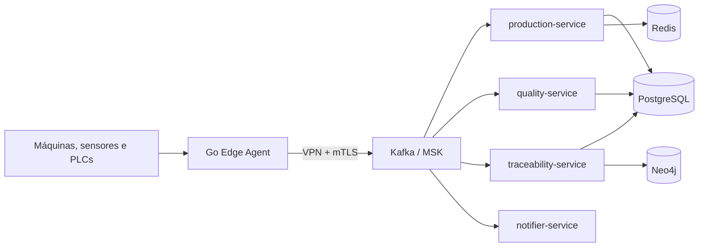

# Plataforma de Rastreabilidade de Produção

Documentação de arquitetura e planejamento de uma plataforma para rastrear a produção desde a matéria-prima no chão de fábrica até o lote final e seu destino. O objetivo é permitir rastreio de origem e recall de produtos afetados de forma rápida e confiável.

> Este repositório é um vault de documentação para Obsidian. A implementação dos serviços está prevista no [roadmap](08-Roadmap/Roadmap.md).

## Objetivos

- Coletar eventos de máquinas, sensores, PLCs e sistemas locais em tempo real.
- Transportar eventos de maneira resiliente entre fábrica e nuvem.
- Registrar produção, consumo de materiais e inspeções de qualidade.
- Construir a genealogia de lotes para consultas de rastreio e recall.
- Operar a plataforma com observabilidade ponta a ponta e infraestrutura como código.

## Arquitetura em resumo

O **Go Edge Agent** normaliza dados próximos às máquinas e mantém um buffer local para tolerar indisponibilidade de rede. O **Kafka** funciona como backbone de eventos. Os serviços de negócio processam produção e qualidade, enquanto o **traceability-service** projeta os eventos no Neo4j para disponibilizar consultas de genealogia, rastreio e recall.

Veja o [diagrama completo](01-Visao-Geral/Diagrama%20Geral.md) e o [fluxo principal](01-Visao-Geral/Fluxo%20Principal.md).

## Stack planejada

| Camada | Tecnologias |
| --- | --- |
| Edge | Go |
| Serviços de negócio | Java e Spring Boot |
| Mensageria | Apache Kafka / AWS MSK |
| Dados | PostgreSQL, Neo4j e Redis |
| Contêineres e orquestração | Docker e Kubernetes / EKS |
| Observabilidade | OpenTelemetry, Prometheus, Grafana, Loki e Tempo |
| Infraestrutura | Terraform e AWS |

Detalhes em [Stack Tecnológica](01-Visao-Geral/Stack%20Tecnologica.md).

## Estrutura do repositório

- [`00-Home`](00-Home/Home.md) — índice inicial do vault.
- [`01-Visao-Geral`](01-Visao-Geral) — contexto, objetivos, arquitetura e glossário.
- [`02-Componentes`](02-Componentes) — responsabilidades dos agentes, serviços e bancos.
- [`03-Padroes`](03-Padroes) — arquitetura hexagonal, outbox, idempotência, DLQ e contratos de eventos.
- [`04-Observabilidade`](04-Observabilidade) — telemetria, métricas, logs, traces e dashboards.
- [`05-Infraestrutura`](05-Infraestrutura) — Kubernetes, AWS, Terraform, segurança, CI/CD e conectividade edge–nuvem.
- [`06-Dominio`](06-Dominio) — modelo de dados, grafo de genealogia, eventos, rastreio e recall.
- [`07-Decisoes`](07-Decisoes) — ADRs que registram as decisões arquiteturais.
- [`08-Roadmap`](08-Roadmap) — fases de implementação, checklist e questões em aberto.
- [`09-Referencias`](09-Referencias) — referências e revisão da arquitetura original.

## Conceitos-chave

- **Rastreio:** identifica a origem de um lote e os insumos que o compõem.
- **Recall:** identifica os produtos, lotes e clientes impactados por uma matéria-prima ou lote.
- **Eventos como fonte de verdade:** o grafo e demais projeções podem ser reconstruídos por replay dos eventos Kafka.
- **Arquitetura hexagonal:** mantém regras de negócio desacopladas de bancos, mensageria e frameworks.

Leia [Recall e Rastreio](06-Dominio/Recall%20e%20Rastreio.md), [Modelo de Grafo](06-Dominio/Modelo%20de%20Grafo.md) e [Catálogo de Eventos](06-Dominio/Catalogo%20de%20Eventos.md) para aprofundar.

## Roadmap

1. Base local com Docker Compose, Kafka, PostgreSQL, Neo4j, Redis e observabilidade.
2. Edge Agent em Go com simulador, buffer local e publicação no Kafka.
3. `production-service` com arquitetura hexagonal e outbox pattern.
4. `traceability-service`, Neo4j e consultas de genealogia.
5. Serviços de qualidade e notificações.
6. Observabilidade, Kubernetes local, AWS/Terraform, segurança e CI/CD.

O detalhamento e a ordem das fases estão em [Roadmap](08-Roadmap/Roadmap.md).

## Como navegar

1. Instale o [Obsidian](https://obsidian.md/).
2. Abra esta pasta como um vault (*Abrir pasta como cofre*).
3. Comece por [Home](00-Home/Home.md) ou por [Contexto e Objetivo](01-Visao-Geral/Contexto%20e%20Objetivo.md).
4. Use a visualização de grafo do Obsidian para explorar os vínculos entre notas.

Os diagramas foram escritos em Mermaid e são renderizados nativamente pelo Obsidian.

## Decisões registradas

As decisões mais importantes estão em ADRs: Go no edge e Java no core, Neo4j para genealogia, outbox pattern, evolução inicial com poucos serviços, Terraform na AWS e OpenTelemetry como padrão de telemetria. Consulte [`07-Decisoes`](07-Decisoes).
